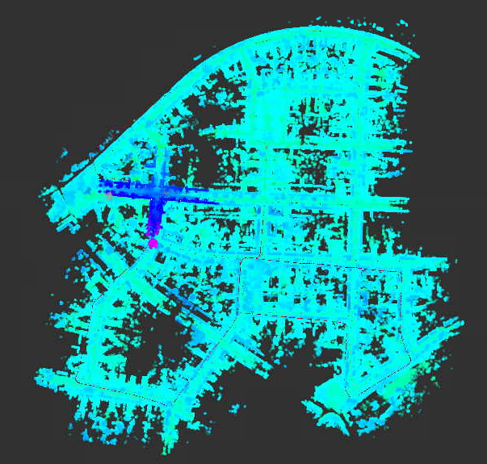
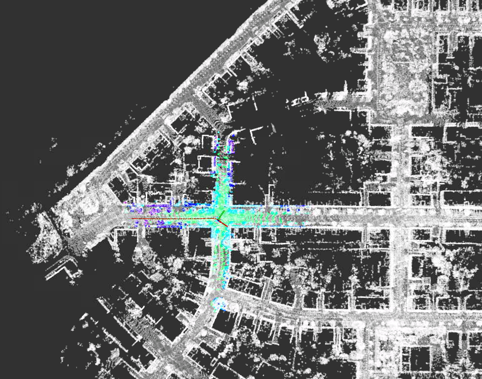
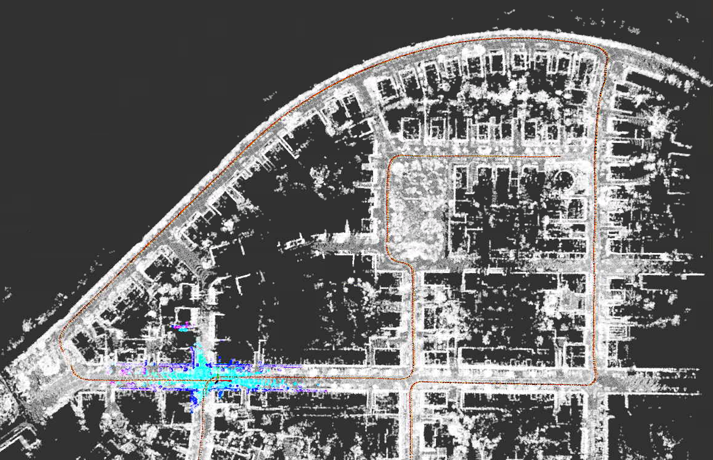
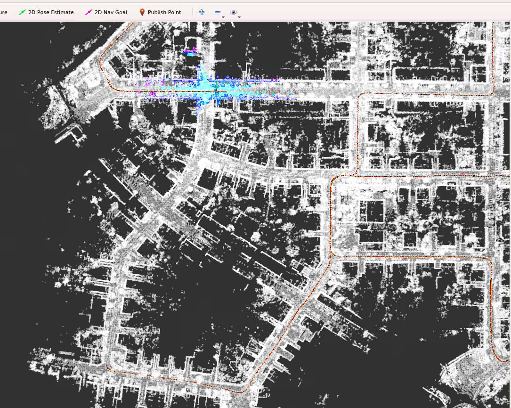
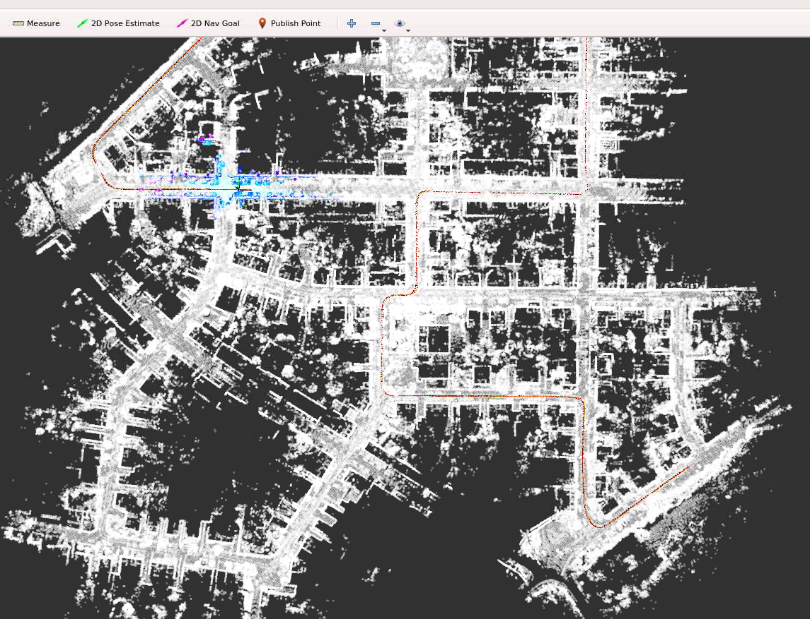
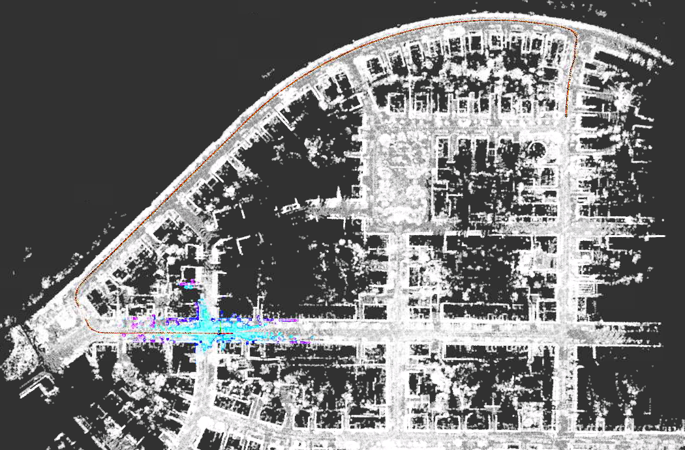

# 深蓝学院《多传感器融合定位》第二期作业

深蓝学院, 多传感器融合定位与建图, 第4章Mapping and Map Based Localization代码框架.

---

## Overview

本作业在课程所给代码框架下，按照作业要求跑通建图流程，用gnss信息实现基于地图信息的全局定位初始化.

---

## homework

###  及格要求：跑通建图流程、保存地图，并截图显示完整地图
结果如下图：

###  良好要求：在建图的基础上，加载点云地图，实现在地图原点的初始化
需要在“matching_flow.cpp”中修改初始化方法，结果如下图：

### 优秀要求：在建图的基础上，实现全局初始化的要求
需要在“gnss_data.cpp”中给定初始化的经纬高的参数，结果如下图：
在100s处初始化：

在200s处初始化：

在300s处初始化：

在400s处初始化：

